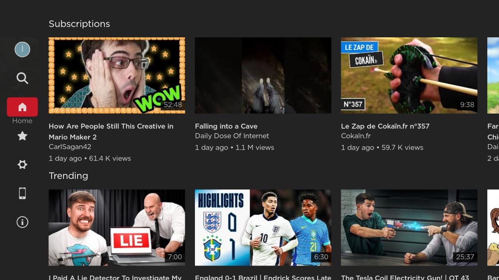
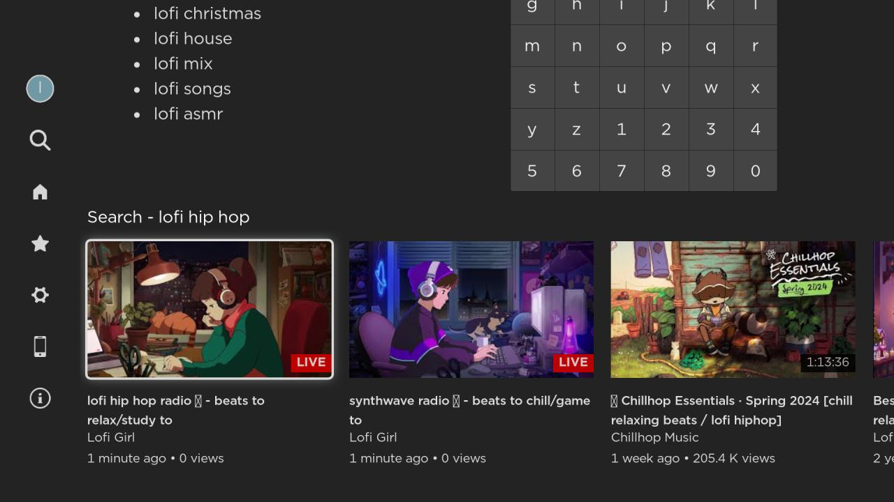
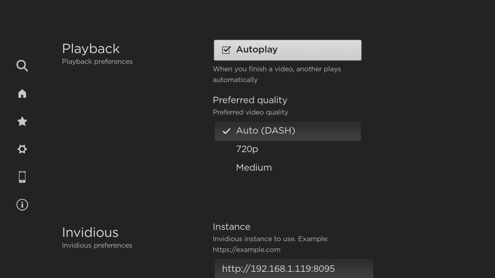

<!-- markdownlint-disable MD033 MD041 -->
<p align="center">
  
  <br/><br/>
  <a href="https://github.com/iBicha/playlet/actions/workflows/release.yml?query=branch%3Amain">
    
  </a>
  <a href="https://github.com/iBicha/playlet/releases">
    
    
  </a>
  <a href="https://hosted.weblate.org/engage/playlet/">
    
  </a>
  <a href="/LICENSE">
    
  </a>
  <a href="https://channelstore.roku.com/details/840aec36f51bfe6d96cf6db9055a372a/playlet">
    
  </a>
  <a href="https://github.com/iBicha/playlet/wiki">
    
  </a>
</p>

# Playlet

Playlet is an unofficial YouTube client for Roku 📺

## Screenshots

  <a href="./docs/screenshots/README.md">

| [](docs/screenshots/README.md) | [](docs/screenshots/README.md) | [](docs/screenshots/README.md) |
| ---------------------------------------------------------------- | -------------------------------------------------------------------- | ------------------------------------------------------------------------ |

  </a>

More under [Screenshots](./docs/screenshots/README.md)

## Installation

[Playlet on Roku channel store](https://channelstore.roku.com/en-ca/details/840aec36f51bfe6d96cf6db9055a372a/playlet)

## Features

- 🔥 No Ads (Not now, not ever)
- 🕵️ No Tracking
- 🛡️ Privacy driven (uses [Invidious](https://invidious.io/) backend)
- ⚔️ [SponsorBlock](https://sponsor.ajay.app/) integration (skips undesirable sections in videos)
- 📱 Browse, search, and cast from phone using the YouTube app or the browser
- 🔮 Picture-in-picture mode
- ⚡ Fast! [Check out how we compare with the official YouTube app](https://youtu.be/qmSvA-QQW20)
- 🔤 Translated using [Weblate](https://hosted.weblate.org/projects/playlet/playlet/)

### Cast from phone

- Open "Remote" tab in Playlet
  - Scan QR Code with Phone, and use the browser; OR
  - Use the YouTube app to connect using the same Wi-Fi; OR
  - Use the `Link with TV code` to connect

### Picture-in-picture

- When viewing a video in full screen, press ⬇️ (down) button on your remote to shrink the video
- You can browse or search for videos while you watch
- To restore currently playing video to full screen, press the ✳️ (options) button

### Customize Invidious instance

1. Open settings in Playlet
1. Select Invidious -> Instance
1. Set a custom instance, or choose a public one hosted by volunteers (from [api.invidious.io](https://api.invidious.io/))
1. Optionally, Select `Test instance` to make sure it works
1. Hit save

> ℹ️ **Note**: If you are logged in when you change the instance, you will remain logged in to the old instance. In this case, Playlet will use the old instance to retrieve your subscriptions and your playlists, but will use the new instance for everything else. After switching to a new instance, you can log out and log in again to use your profile on the new instance.

## Development

For everything related to Playlet app development, please see the [documentation](./docs/README.md)

## Analytics and reporting

We do not collect any usage data, anonymous or not. But Roku does, and you can find the data made available to Playlet in the [Wiki](https://github.com/iBicha/playlet/wiki).
Most software in the wild collect some data to make sure things work, and to prioritize features.
Because we don't do that, we wouldn't know if people using Playlet are facing issues, unless these issues get reported.
Playlet could run on variaty of devices, with different capabilities and screen sizes, and different Invidious instances.
That's why it's important to report any issues you encouter using Playlet, otherwise it's unlikely that they get addressed.

## Why Playlet

```none
playlet - noun
play•let /ˈplālət/
: a short play
```

**Playlet** is about keeping the time you spend on YouTube short and useful. It values your time, so it does not show you ads, and allows you to skip sponsored sections and other irrelevant information that's designed to monitize you and/or waste your time.

There's a cliché about how a lot of open source software is **`"Made with ♡"`**. This project in particular is **not**.<br/>
**Playlet** was created out of **spite**, because I believe I have watched enough back-to-back, unskippable YouTube ads for a lifetime.

By removing all the bloat, the ads, the tracking, we could end up with an even faster app than the official one.

In any case, I hope you find **Playlet** useful, and pleasant to use.

## Disclaimer

**Playlet** does not serve or distribute any material from unauthorized sources.<br/>
**Playlet** is simply a frontend to other systems (such as [Invidious](https://github.com/iv-org/invidious)), bringing the watching experience to the TV, as opposed to the existing frontends that are web and mobile focused.<br/>
**Playlet** authors acknowledge that all trademarks and registered trademarks mentioned in this repository and related pages are the property of their respective owners. The use of these trademarks or trade names is for identification purposes only and does not imply any endorsement, affiliation, or sponsorship by the trademark owner.

<!-- markdownlint-configure-file {"MD024": { "siblings_only": true } } -->
